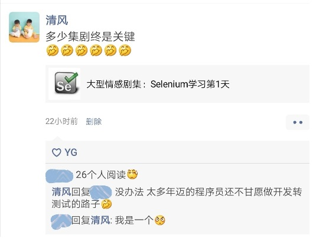
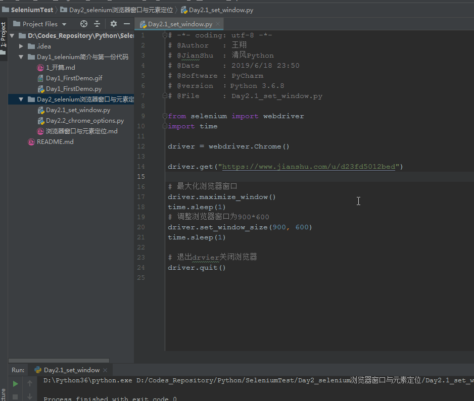
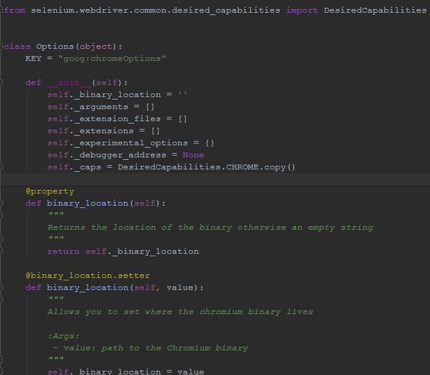
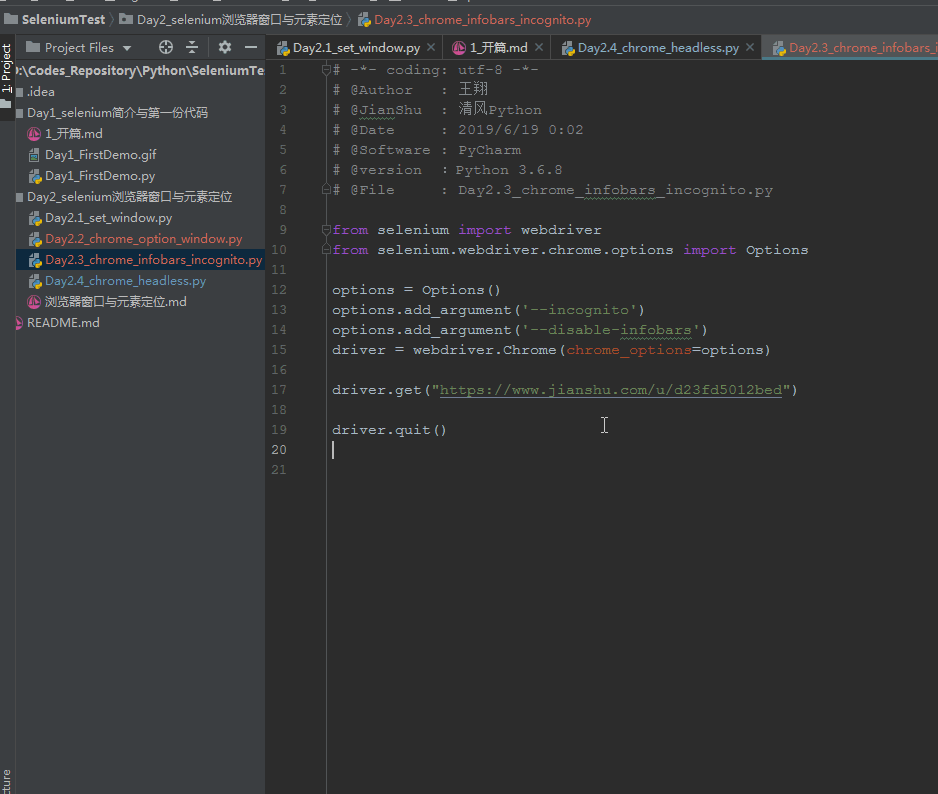

##### python从入门到放弃
今天用一张朋友圈截图开篇吧...


不出所料与果不其然...又被嘲讽了啊，这个流汗的表情暴击一万点伤害。
每天在嘲讽中学习，我感觉可以写一本辛酸泪的书了，名字叫【公众号，从发文到放弃】，哈哈！
其实这种针对个别群体的文章，远不如娱乐性质的python文章来的有吸引力。
就好比我隔壁工位的盆友，今天说“你总是夜里发文章，早上就被其他公众号冲走了，你看冷兔的公众号，早上刚发马上十几万的浏览量...”我转手就卸载了微信上所有冷兔的表情，惹不起还躲不起了，哥也是有脾气的人！
不吹不卖，继续今天的系列

##### 上集回顾
昨天说简单介绍了什么是selenium，它能干what，和发展史与梗概。当的是python如何通过pip安装selenium，并下载对应浏览器的webdriver。
最后简单通过一个Demo描述了下如何导入selenium模块，并通过webdriver打开浏览器(我用的chrome)，访问我的简书...

##### 今日内容
按照大纲来说，今天该讲selenium的几种对象定位方法了。但我按照套路来吧，你们说无趣，不按照套路来，又怕翻车丢粉。
可就这么就这么几个人关注，我按照套路那么写，怎么突出我的独树一帜？
所以我今天要说webdriver的options！

##### options？WTF...
为了成功的引出options，我们先来说一个现象。selenium默认打开窗口只是半屏的宽度，很多时候为了让视觉优化，我们需要使之全屏。
但有时候，我们需要多开浏览器，又需要它小屏...这样，我们需要设置浏览器的分辨率。看下面代码：
```python
# -*- coding: utf-8 -*-
# @Author   : 王翔
# @JianShu  : 清风Python
# @Date     : 2019/6/18 23:50
# @Software : PyCharm
# @version  ：Python 3.6.8
# @File     : Day2.1_set_window.py

from selenium import webdriver
import time

driver = webdriver.Chrome()

driver.get("https://www.jianshu.com/u/d23fd5012bed")

# 最大化浏览器窗口
driver.maximize_window()
time.sleep(1)
# 调整浏览器窗口为900*600
driver.set_window_size(900, 600)
time.sleep(1)

driver.quit()
```



很多书上，都会告诉读者，通过`.maximize_window()`设置全屏，而使用`.set_window_size(900, 600)`设置特定的分辨率。
这样设置没错，但如果我是面试官，你这么答，顶多给你70分，不能再多了...why?

多数情况下，我们如何设置窗口的分辨率，是在我们在编码前就可以确定的。那么为什么要等到浏览器已经启动后，再去设置这些东西呢？
先小屏，然后再调整成大屏，脱裤子放屁，多此一举...如何优化？
**就到了今天要说的options！**

##### chrome.options
首先，我们需要导入options：
`from selenium.webdriver.chrome.options import Options`
既然导入了，就进去看看源码呗...

看这好像也没啥，定义了一堆列表和字典，然后创建了一堆property装饰器用来get、set方法用于设置...
但这里面的参数，多到你怀疑人生.不信你去看看介绍[Chromium命令行开关列表](https://peter.sh/experiments/chromium-command-line-switches/)。
说的太多就跑题了，挑一些说说。
先回到刚才的问题，如何设置浏览器分辨率，才是更优雅的做法？看代码
```python
# -*- coding: utf-8 -*-
# @Author   : 王翔
# @JianShu  : 清风Python
# @Date     : 2019/6/19 0:02
# @Software : PyCharm
# @version  ：Python 3.6.8
# @File     : Day2.2_chrome_options.py

from selenium import webdriver
from selenium.webdriver.chrome.options import Options

options = Options()
options.add_argument('--start-maximized')
driver = webdriver.Chrome(chrome_options=options)

driver.get("https://www.jianshu.com/u/d23fd5012bed")

driver.quit()
```
我们通过导入Options，并对选项进行设置，之后在webdriver创建时导入参数。
这样就不会出现刚才那种先打开浏览器，再调整成最大尺寸的问题了。这个考点小本本记下，面试会考，哈哈...(反正上周面试那几个的时候，没人给我这个回答)
有人说了，就为了这一个问题，你又是引入子类，又是设置、导入配置的，我宁愿像刚才那么搞。
可我说了啊，options的选项多到你怀疑人生。举几个常用的例子：
有些血气方刚的爱国小青年，往往在夜深人静的时候，喜欢仇视下日韩的*娱乐文化*，此时他们会打开Chrome的无痕模式，那么selenium怎么打开无痕模式呢？
`options.add_argument('--incognito')`  *incognito：伪装、隐姓埋名的意思...*
这个不是考点，但很多年轻人现在已经在记笔记了！
再来说说强迫症患者需要的，selenium打开浏览器后，浏览器页面顶部会有一个提示栏**chrome正受到自动测试软件的控制...**，每次看到这个提示栏，我的强迫症就犯了，有种团战可以输，影魔必须死的感受，不点掉它我心难安啊！那么这个该怎么取消？
`options.add_argument('--disable-infobars')` 一瞬间火女莱恩双大影魔回泉水读秒...
```python
from selenium import webdriver
from selenium.webdriver.chrome.options import Options

options = Options()
options.add_argument('--incognito')
options.add_argument('--disable-infobars')
driver = webdriver.Chrome(chrome_options=options)

driver.get("https://www.jianshu.com/u/d23fd5012bed")

driver.quit()
```

再来一个抢饭碗的，PhantomJS一直是无界面浏览器的标杆，但chrome59版本开始增加了Chrome-headless模式，可以无界面运行浏览器，瞬间抢了PhantomJS的饭碗，走自己的路，让别人无路可走啊！
有些人说了，不显示浏览器，怎么知道浏览器打开没呢？最简单的方式，打印一下当前窗口的title呗...
```python
from selenium import webdriver
from selenium.webdriver.chrome.options import Options
import time

options = Options()
options.add_argument('--headless')

driver = webdriver.Chrome(chrome_options=options)


driver.get("https://www.jianshu.com/u/d23fd5012bed")
time.sleep(3)
print(driver.title)
# 退出drvier关闭浏览器
driver.quit()

>>>output: 清风Python - 简书
```
以上这些，真是options中的九牛一毛，更多详细的内容，会在以后的文章用到时，再介绍...

##### To Be Continue
今天的内容就到这里，如果觉得有帮助，欢迎将文章或者我的公众号【清风Python】分享给更多喜欢python的人

