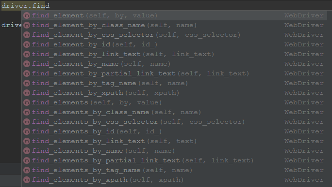
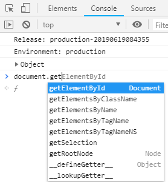
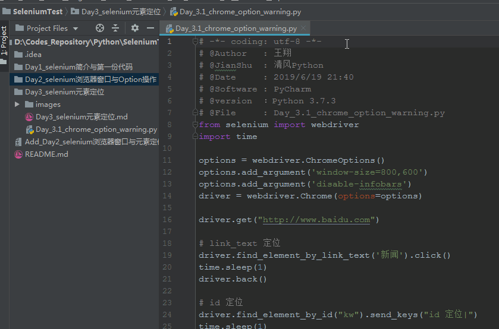

##### 关于昨天的文章
今天有朋友反馈，代码运行的时候，selenium提示警告
> DeprecationWarning: use options instead of chrome_options
> driver = webdriver.Chrome(chrome_options=options)

本来以为是我的selenium版本太低了，可以上官网看到3.141.0是最新版本啊，最后把python从3.6.8升级到3.7.3才复现了此问题。虽然这个告警不影响使用，但既然官方提示了修改就看看呗，其实很简单：
```python
# 将原本的chrome_options
driver = webdriver.Chrome(chrome_options=options)
# 改为options 即可
driver = webdriver.Chrome(options=options)
# 另外，针对以下引用
from selenium.webdriver.chrome.options import Options
options = Options()
# 可以简写为：
options = webdriver.ChromeOptions()
```

##### 今天说什么
今天肯定说元素定位啊，再不说都要取关了...可应该怎么说呢？
话说，selenium1.0起初它使用了基于Javascript的自动化引擎，而浏览器对 Javascript 又有很多安全限制，之后后通过webdrvier进行了各浏览器的协议封装。那么说到底，我们通过selenium变相的完成了js的的相关操作，比如：

再来看看js的dom对象：


selenium将JavaScript的HTML DOM进行了封装处理，最终提供给我们进行使用。引申出三点：
1. 开发转测试，真的是有优势的
2. 作为一个合格的测试，抽时间学学html css 和js 也是对自己能力的提升
3. 爬虫熟识的html解析库Beautifulsoup4，元素的定位上用法也类似以上两者，一通百通！

##### selenium元素定位
WebDriver提供了一系列的定位符以便使用元素定位方法。常见的定位符有以下几种：
- id
- class name
- name
- tag
- link text
- partial link text
- xpath
- css selector

而针对元素定位，selenium又分为`find_element_by`和`find_elements_by`。即找到一个元素和找到所有元素。
针对`find_elements_by`，我们又可以针对找到的元素，我们又可以像python操作list一样进行切片，筛选等操作。
我们以百度为例，介绍以上方法：

|方法Method|描述Description|参数Argument|示例Example|
|--|--|--|--|
|id|该方法通过ID的属性值去定位查找单个元素|id: 需要被查找的元素的ID|find_element_by_id('kw')|
|class name|该方法通过class的名称值去定位查找单个元素|class_name: 需要被查找的元素的类名|find_element_by_class_name('s_ipt')|
|name|该方法通过name的属性值去定位查找单个元素|name: 需要被查找的元素的名称|find_element_by_name('wd')|
|tag_name|该方法通过tag的名称值去定位查找单个元素|tag: 需要被查找的元素的标签名称|find_element_by_tag_name('input')|
|link_text|该方法通过链接文字去定位查找单个元素|link_text: 需要被查找的元素的链接文字|find_element_by_link_text('百度一下')|
|partial_link_text|该方法通过部分链接文字去定位查找单个元素|link_text: 需要被查找的元素的部分链接文字|find_element_by_partial_link_text('百度')|
|css_selector|该方法通过CSS选择器去定位查找单个元素|css_selector: 需要被查找的元素的ID|find_element_by_css_selector('#su')|
|xpath|该方法通过XPath的值去定位查找单个元素|xpath: 需要被查找的元素的xpath|find_element_by_xpath('//*[@id="su"]')|

下来我们用代码针对百度进行演示
```python
# -*- coding: utf-8 -*-
# @Author   : 王翔
# @JianShu  : 清风Python
# @Date     : 2019/6/19 21:40
# @Software : PyCharm
# @version  ：Python 3.7.3
# @File     : Day_3.1_chrome_option_warning.py
from selenium import webdriver
import time

options = webdriver.ChromeOptions()
options.add_argument('window-size=800,600')
options.add_argument('disable-infobars')
driver = webdriver.Chrome(options=options)

driver.get("http://www.baidu.com")

# link_text 定位
driver.find_element_by_link_text('新闻').click()
time.sleep(1)
driver.back()

# id 定位
driver.find_element_by_id("kw").send_keys("id 定位|")
time.sleep(1)

# class name 定位
driver.find_element_by_class_name("s_ipt").send_keys("class name 定位|")
time.sleep(1)

# name 定位
driver.find_element_by_name("wd").send_keys("name 定位|")
time.sleep(1)

# css 定位
driver.find_element_by_css_selector("#kw").send_keys("css 定位|")
time.sleep(1)

# xpath 定位
driver.find_element_by_xpath("//input[@id='kw']").send_keys(" xpath 定位|")
time.sleep(1)

driver.quit()

```
效果如下：



##### To Be Continue
今天的内容就到这里，如果觉得有帮助，欢迎将文章或者我的公众号【清风Python】分享给更多喜欢python的人
