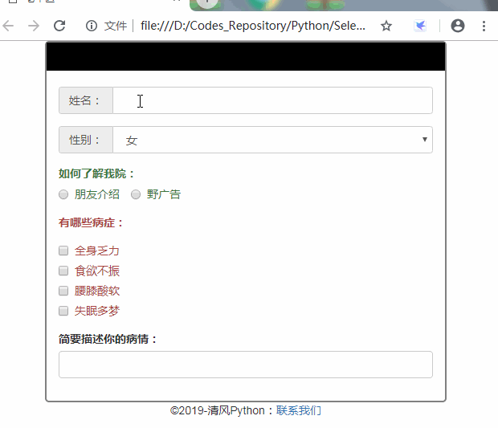
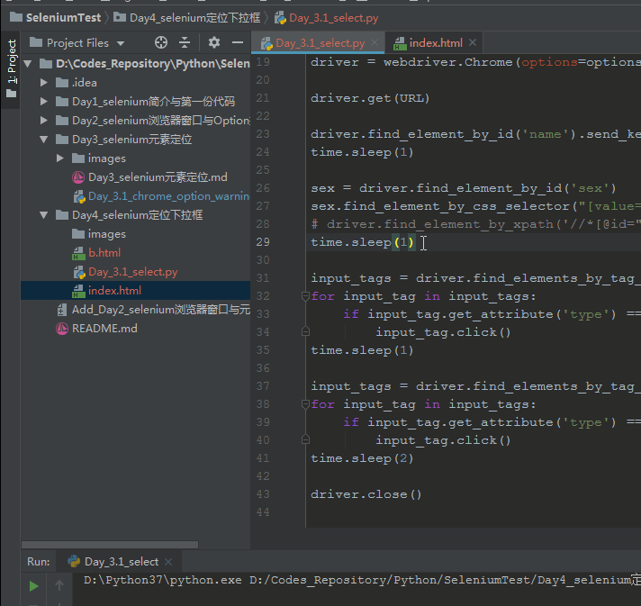

### 又要开篇叨叨
昨天没有更新，但因为下大雨没撸串，陪孩子玩了下前一天写的[Flask开发猜数字小游戏---聪明的奥特曼](https://www.jianshu.com/p/87eb0529857d),发现代码有些bug，进行了修改，另外只是名字叫聪明的奥特曼，我的俩爷不买账啊，没办法，将成功的alert改为展示奥特曼的图片，才把他俩打发。至于做对？别逗了，我都改成猜1-4了都各种错，就急着点完了看奥特曼，真是气死我了.....

### 今天讲什么
讲什么标题说了，讲selenium的单选、多选、下拉框选项定位。但其实这东西，没什么太多说的，又比较枯燥，那该怎么让这一集selenium的课程变得有趣呢？有请老中医，哈哈....


怎么样，这个野广告做的还不错吧，你们给多少分？至于为什么要自己写一个html的页面，一是懒得找什么网页又有下来框体，又有单/多选。二是最近更多的想练习写一些web界面，最重要的是怕大家觉得selenium系列的文章没意思，所以搞点噱头呗。哈哈....
页面实现起来比较简单，样式用Bootstrap即可，至于这个城中村经典广告牌，只要简单的使用jQuery添加和删除css样式就OK了。
代码如下：
```html
<!DOCTYPE html>
<html lang="en">

<head>
    <meta charset="UTF-8">
    <title>老中医</title>
    <link href="https://cdn.bootcss.com/twitter-bootstrap/3.3.7/css/bootstrap.min.css" rel="stylesheet">
    <script src="https://cdn.bootcss.com/jquery/3.4.1/jquery.min.js"></script>
    <style type="text/css">
    body {
        height: 500px;
    }

    .container {
        max-width: 500px;
        height: 450px;
        border: 2px solid grey;
        border-radius: 5px;
    }

    .ad {
        text-align: center;
        font-size: 25px;
        background-color: black;
        color: red;
        margin-bottom: 20px;
    }

    .chuibi {
        display: inline-block;
    }

    .adplus {
        color: black;
    }

    .footer {
        text-align: center;
    }
    </style>
</head>

<body>
    <form class="container">
        <div class="row">
            <div class="ad ">祖传男科老中医
                <div class="small chuibi"> 【华佗在世，扁鹊转生】
                </div>
            </div>
        </div>
        <div class="form-group ">
            <div class="input-group">
                <div class="input-group-addon">
                    姓名：
                </div>
                <input id='name' class="form-control" />
            </div>
        </div>
        <div class="form-group ">
            <div class="input-group">
                <div class="input-group-addon">
                    性别：
                </div>

                <select id="sex" class="form-control">
                    <option value="女">女</option>
                    <option value="男">男</option>
                </select>
            </div>
        </div>
        <div class="form-group has-success">
            <div><label class="control-label">如何了解我院：</label></div>
            <label class="radio-inline">
                <input type="radio" name="access" id="inlineRadio2" value="朋友介绍"> 朋友介绍
            </label>
            <label class="radio-inline">
                <input type="radio" name="access" id="inlineRadio1" value="野广告">野广告
            </label>
        </div>
        <div class="form-group has-error">
            <div><label class="control-label">有哪些病症：</label></div>
            <div class="checkbox">
                <label>
                    <input type="checkbox" value="全身乏力">
                    全身乏力
                </label>
            </div>
            <div class="checkbox ">
                <label>
                    <input type="checkbox" value="食欲不振">
                    食欲不振
                </label>
            </div>
            <div class="checkbox ">
                <label>
                    <input type="checkbox" value="腰膝酸软">
                    腰膝酸软
                </label>
            </div>
            <div class="checkbox ">
                <label>
                    <input type="checkbox" value="失眠多梦">
                    失眠多梦
                </label>
            </div>
        </div>
        <div class="form-group">
            <div><label class="control-label">简要描述你的病情：</label></div>
            <input id='summary' class="form-control" type="text">
        </div>

    </form>
    <div class="footer">
        ©2019-清风Python：<a href="https://www.jianshu.com/u/d23fd5012bed">联系我们</a>
    </div>
    <script>
    setInterval(function() {
        var title = $('.ad')
        if (title.hasClass('adplus')) {
            title.removeClass('adplus')
        } else { $('.ad').addClass('adplus') }
    }, 600);
    </script>
</body>

</html>
```
### 入主题
先来说说下拉框吧，网上很多的帖子说下拉框的选择必须要先定位到下拉框体，然后点击框体，才能获取选项并选中，其实不然。90%的下拉框都会提前将option内容保存在html中，只有极少情况时通过AJAX请求的(这种情况之后的课程说....)。所以针对这种选项类的使用，推荐使用xpath和css_selector去定位。因为可变概率较小....
至于单选和多选，主要是通过`driver.find_elements_by_tag_name('input')`，然后进行批量循环判断input选项完成选择。
说了这么多，不如直接看代码来的直观：
```python
# -*- coding: utf-8 -*-
# @Author   : 王翔
# @JianShu  : 清风Python
# @Date     : 2019/6/22 22:04
# @Software : PyCharm
# @version  ：Python 3.7.3
# @File     : Day_3.1_select.py

from selenium import webdriver
import time

# 本地文件，根据你们的位置，自行修改
URL = 'file:///D:/Codes_Repository/Python/SeleniumTest/Day4_selenium定位下拉框/index.html'

options = webdriver.ChromeOptions()
# 调整窗口大小，主要是为了使减小gif文件大小，方便截图上传
options.add_argument('window-size=650,650')
options.add_argument('disable-infobars')
driver = webdriver.Chrome(options=options)

driver.get(URL)

driver.find_element_by_id('name').send_keys("隔壁老王")
time.sleep(1)

sex = driver.find_element_by_id('sex')
sex.find_element_by_css_selector("[value='男']").click()
# driver.find_element_by_xpath('//*[@id="sex"]/option[2]').click()
time.sleep(1)

input_tags = driver.find_elements_by_tag_name('input')
for input_tag in input_tags:
    if input_tag.get_attribute('type') == 'radio' and input_tag.get_attribute('value') == '野广告':
        input_tag.click()
time.sleep(1)

input_tags = driver.find_elements_by_tag_name('input')
for input_tag in input_tags:
    if input_tag.get_attribute('type') == 'checkbox' and input_tag.get_attribute('value') != '腰膝酸软':
        input_tag.click()
time.sleep(2)

driver.close()
```
看下隔壁老王前来就诊的效果：


由于页面只有一组单选和多选，所以无需多做判断，但如果网页上存在多组的单选和多选。那还需要针对他们自身的特性进行分析，知识是死的，要学会灵活运用才行....

### To Be Continue
今天的内容就到这里，如果觉得有帮助，欢迎将文章或者我的公众号`【清风Python】`分享给更多喜欢python的人