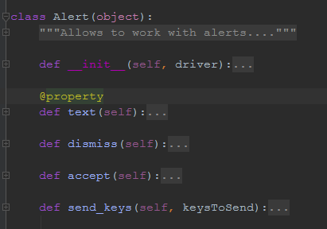
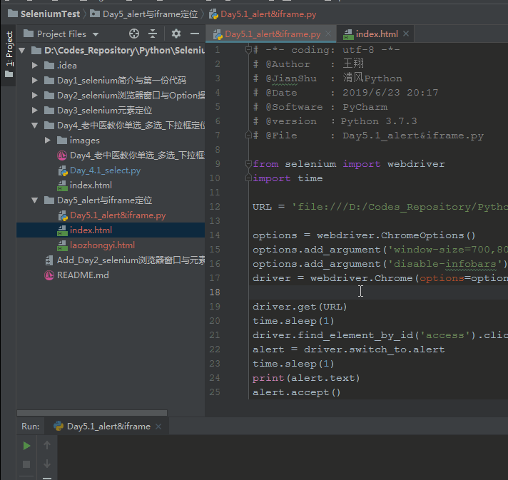
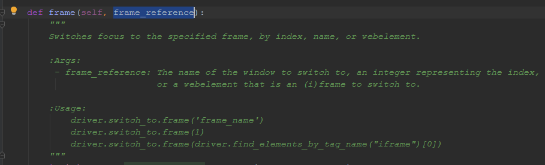
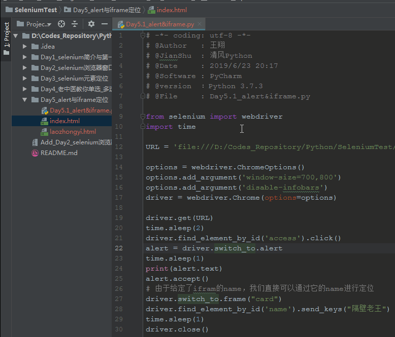

##### 有种感觉
有种感觉，是否应该尽快结束这个selenium的情感剧。因为自从开始写这个系列的文章，阅读量就好少好少。虽说是学习总结，但码字比学习更费时间，写完了还没人看，心塞。

##### 今日要闻
今天和大家说说alert与iframe框架早selenium定位中，存在的问题吧。
很多网站，一些功能还在使用简陋的alert进行弹窗确认操作。但是selenium如何可以定位到js弹窗的内容呢？之前说到的那些id class 等等方法肯定是不行的。所以selenium针对这个问题，编写了单独的方法。
`driver.switch_to.alert()`，源码可以看到`alert = Alert(self._driver)`

|方法|说明|
|---|----|
|text |获取alert文本内容|
|dismiss|点击“取消”或“cancel”|
|accept|点击“确认”或“OK”|
|send_keys|发送文本|
我们先来写一个义诊活动说明页面来看看alert的使用吧：
```html
<!DOCTYPE html>
<html lang="en">

<head>
    <meta charset="UTF-8">
    <title>alert与iframe</title>
    <link href="https://cdn.bootcss.com/twitter-bootstrap/3.3.7/css/bootstrap.min.css" rel="stylesheet">
    <style type="text/css">

        .container {
            max-width: 650px;
            border: 2px solid grey;
            border-radius: 5px;
        }
    </style>
</head>

<body>
<div class="container">
    <h2 class="text-center ">老中医亲情大回馈，义诊活动开始啦！</h2>
    <div>
        <p class="strong text-warning">欢迎各位父老乡亲前来就诊！请点击同意隐私获取授权：
            <a id='access' href="javascript:alert('我同意该条款.')">点我确认</a></p>
    </div>
</div>
</body>
</html>
```
下来看看alert的消息弹窗与获取窗口的实现吧：

代码片段如下，so easy:
```python
......
driver.find_element_by_id('access').click()
# 定位alert串口
alert = driver.switch_to.alert
time.sleep(1)
# 打印alert的文本信息
print(alert.text)
# 点击alert确认按钮
alert.accept()
......
```

##### iframe窗体定位
昨天写了一个老中医的问诊单，如果我们把它通过iframe添加到这个义诊活动的统一数内部，那么还可以使用简单的find_element去定位吗，但是否定的.....why？iframe是一个内联框架，你可以理解为浏览器的选项卡1中嵌套了选项卡2，你可以从选项卡1直接定位选项卡2中的内容么？必然不行....那么该如何？其实这个很简单。使用：`driver.switch_to.frame()`
来样子看看frame的源码：

我们可以先定位到这个iframe，然后吧这个定位节点传给frame方法，就可以进入到iframe中进行操作了。
```html
    <iframe name="card" src="laozhongyi.html" width="600" ,
            height="600" frameborder="0"></iframe>
```
总体代码如下：
```python
# -*- coding: utf-8 -*-
# @Author   : 王翔
# @JianShu  : 清风Python
# @Date     : 2019/6/23 20:17
# @Software : PyCharm
# @version  ：Python 3.7.3
# @File     : Day5.1_alert&iframe.py

from selenium import webdriver
import time

URL = 'file:///D:/Codes_Repository/Python/SeleniumTest/Day5_alert与iframe定位/index.html'

options = webdriver.ChromeOptions()
options.add_argument('window-size=700,800')
options.add_argument('disable-infobars')
driver = webdriver.Chrome(options=options)

driver.get(URL)
time.sleep(1)
driver.find_element_by_id('access').click()
alert = driver.switch_to.alert
time.sleep(1)
print(alert.text)
alert.accept()
# 由于给定了ifram的name，我们直接可以通过它的name进行定位
driver.switch_to.frame("card")
driver.find_element_by_id('name').send_keys("隔壁老王")
time.sleep(1)
driver.close()
```
实现效果：


##### To Be Continue
今天的内容就到这里，如果觉得有帮助，欢迎将文章或我的微信公众号`【清风Python】`分享给更多喜欢python的人，谢谢。